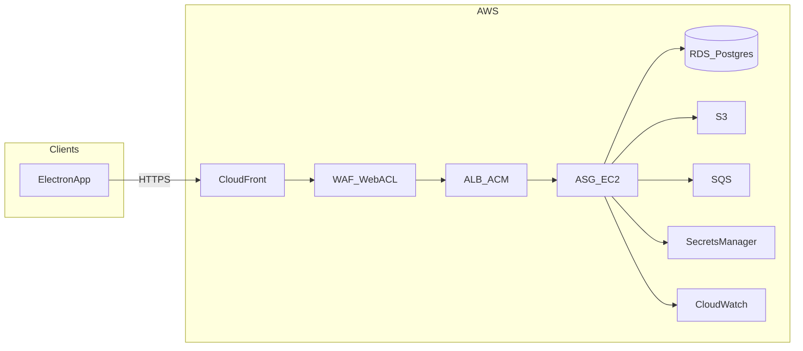

# Production cloud design (AWS)

**Purpose:** Describe the **production / beta** AWS deployment: request path, components, deployment-related **business rules**, and **HLD/LLD** for cloud infrastructure. Authoritative product behavior remains in the BRD, HLD, and LLD linked below; this document adds **cloud-specific** constraints and settings.

**Audience:** Developers and operators implementing or maintaining Terraform, runtime config, and releases.

**Related beta plan:** Cursor plan `beta_aws_production_plan_ad76cfe7` (IaC todos and phased rollout).

---

## 1. System context

### 1.1 Logical request flow

```text
User → CloudFront → WAF → ALB → EC2 → Nginx → Gunicorn → Uvicorn → FastAPI
```

- **User** clients include the **Electron** desktop app (and any browser-based access configured with the same API base URL).
- **EC2** instances are managed by an **Auto Scaling Group** (see §3.4).

### 1.2 Diagram (conceptual)



**Implementation note:** In AWS, **WAFv2** is **associated** with **CloudFront** or a **regional** resource (e.g. ALB). It is not a separate routed hop. The usual pattern with CloudFront in front is **one** Web ACL on the **CloudFront** distribution (inspection at edge before origin fetch). **CloudFront-scoped** Web ACLs are defined in **us-east-1** per AWS requirements; regional resources (ALB, RDS, ASG) may live in e.g. **ap-south-1**—Terraform typically uses a second `provider "aws"` alias for `us-east-1` where needed.

---

## 2. Component inventory

### 2.1 CloudFront

- **Role:** HTTPS entry for users; **origin** = **ALB** (application load balancer).
- **TLS:** Viewer certificate via **ACM** in **us-east-1** (CloudFront requirement).
- **Caching:** Configure **behaviors** so **API** paths are not cached incorrectly (e.g. forward all headers/cookies for authenticated API, or disable cache for `/` API routes). Exact behavior list is implementation-specific.

### 2.2 AWS WAF

- **Role:** Rate limits and managed rule groups at the edge (or regional on ALB if chosen—prefer **one** primary association to avoid duplicate tuning).
- **Tuning:** Long-running requests and large uploads must be allowed after testing; align with **Gunicorn timeout** and **Nginx** timeouts (§4.2).

### 2.3 Application Load Balancer (ALB) + ACM

- **Role:** Load balance to **EC2** instances in the **target group**; **TLS** between **CloudFront** and **ALB** (ACM certificate in the **same region** as ALB, e.g. ap-south-1).
- **Health checks:** Should target a stable HTTP path such as **`/health`** (see `backend/app/routers/health.py`).

### 2.4 Auto Scaling Group (ASG) + EC2

| Setting | Value |
|---------|--------|
| Min | 1 |
| Desired | 1 |
| Max | 2 |

- **Launch Template:** OS, instance type, IAM instance profile, **user-data** (bootstrap), security groups.
- **Health check:** **ELB**-based; **grace period** 300s; **default cooldown** 300s; **scale-in protection** off unless changed.
- **Step scaling (no target tracking):** scale-out **+1** (step policy, warmup 300s) on load signals; scale-in **-1** (cooldown 900s) only on sustained low average CPU (see §7.4). **Max size capped at 2** in Terraform validation.
- **Application stack on instance:** **Nginx** → **Gunicorn** → **FastAPI**; **systemd** processes for **watcher** and other automation (see §5).

### 2.5 Gunicorn and Nginx (locked per instance)

| Setting | Value |
|---------|--------|
| `workers` | 4 |
| `worker_class` | `uvicorn.workers.UvicornWorker` |
| `timeout` | 60 (seconds) |

- **Nginx:** `proxy_read_timeout` (and related proxy timeouts) should be **≥ 60** seconds so the proxy does not close before Gunicorn.

### 2.6 RDS (PostgreSQL)

- **Instance class:** **`db.t4g.micro`** (as deployed; Terraform default aligned to this).
- **Storage:** **gp3**, **20 GiB** initial, **storage autoscaling** up to **100 GiB** (`max_allocated_storage`); encryption at rest.
- **Backups:** retention **15 days**; **deletion protection** enabled (Terraform).
- **Credentials:** master password in **Secrets Manager** (`manage_master_user_password`); app **`DATABASE_URL`** built via **`deploy/ec2/write-database-url.sh`** where used.
- **Private subnets**; access only from application security group.
- **Alarm context:** **`rds_max_connections_for_alarms`** = **45** for connection-threshold alarms; **free-disk** alarm when **`FreeStorageSpace`** &lt; **5 GiB** (see §7.3–7.4).

### 2.7 S3

- **Artifacts** (uploads, OCR output, challans, bulk uploads): **object keys** with **per-dealer** prefixes; **block public access**; encryption at rest.
- **Terraform:** `terraform/network/s3_data.tf` defines the data bucket (name `"{project_name}-data-{account_id}"`). EC2 IAM allows `GetObject` / `PutObject` / `ListBucket` on that bucket only. Set **`S3_DATA_BUCKET`** on the app host and **`STORAGE_BACKEND=s3`** so the API syncs `Uploaded scans/` and `ocr_output/` trees under keys `uploaded-scans/{dealer_id}/…` and `ocr-output/{dealer_id}/…`. **Presigned GET URLs** are returned in **`print_jobs`** on Fill DMS / Insurance / Gate Pass responses for the Electron client to print locally (the server does not print to dealer printers).

### 2.8 SQS

- Standard queue for async/bulk work; **DLQ** where appropriate; IAM scoped to queue ARNs. **Consumer semantics** must be safe when **two** EC2 instances run (§5).

### 2.9 Secrets Manager

- Store **`DATABASE_URL`**, **`JWT_SECRET`**, and other secrets; inject at runtime (avoid plain secrets in Terraform state where possible).

### 2.10 CloudWatch

- **Unified agent on EC2** (user_data): **`mem_used_percent`**, **`disk_used_percent`** → namespace **`CWAgent`** (see §7.5).
- **Alarms** (warning + critical where defined) on **EC2** (CPU, memory), **ALB** (latency, 5xx, request rate per target, healthy hosts), **RDS** (CPU, free memory, connections, **free disk**), **SQS** (optional, when queue names set in Terraform). **SNS topic** for email; **step scaling** policies wired to scale-out signals; scale-in from low CPU only. Detail in **§7.4**.

### 2.11 Terraform

- **IaC** for VPC, edge (CloudFront, WAF, ALB, ACM), ASG, RDS, S3, SQS, IAM, etc.
- **Remote state:** S3 + DynamoDB table for locking (or Terraform Cloud).

---

## 3. HLD (production cloud)

| Layer | Components |
|-------|----------------|
| **Edge** | CloudFront, WAF, public DNS |
| **Ingress** | ALB, ACM |
| **Compute** | ASG, EC2, Nginx, Gunicorn, FastAPI, systemd workers |
| **Data** | RDS PostgreSQL, S3 |
| **Async** | SQS (+ DLQ) |
| **Secrets** | Secrets Manager, IAM instance profiles |
| **Observability** | CloudWatch |

**Trust boundaries:** Internet clients **only** reach **CloudFront**; **ALB** is not directly exposed to end users if all traffic goes through CloudFront (security group rules should enforce **CloudFront → ALB** patterns as appropriate for your account setup).

---

## 4. LLD (implementation notes)

### 4.1 Health checks

- **ALB → target:** `GET /health` (or configured path) on the app port behind Nginx.
- **Gunicorn:** Four worker processes per instance handling concurrent ASGI requests.

### 4.2 Timeouts

- **Gunicorn `timeout`:** 60 seconds.
- **Nginx:** Upstream read timeout **≥ 60s** for API locations.

### 4.3 WAF + CloudFront

- Prefer **single** Web ACL on **CloudFront** for the logical flow “CloudFront → WAF → ALB”.
- Terraform: account for **us-east-1** provider for CloudFront + CloudFront-scoped WAF resources.

### 4.4 Terraform layout (pointer)

- Repository `terraform/` (to be added during implementation): modules for **network**, **data**, **edge**, **compute**, **observability**; stacks per environment (`staging`, `prod`).

---

## 5. Business rules (deployment-relevant)

These **restate** constraints that affect how we deploy and scale; numbered business rules live in the BRD/HLD.

1. **Authentication:** Production must not run with **`AUTH_DISABLED=true`**. JWT secret must meet application minimum length (see `backend/app/main.py` lifespan validation).
2. **Multi-tenancy:** API and storage must scope data by **authenticated dealer** (JWT), not a single environment `DEALER_ID` for all tenants.
3. **CORS:** `CORS_ORIGINS` must list **explicit** production origins (e.g. Electron or web origins); do not rely on development-only regex defaults.
4. **Encryption:** RDS and S3 use **encryption at rest**; TLS in transit from clients to CloudFront and from CloudFront to ALB.
5. **ASG max = 2 + background workers:** When **two** instances run, **each** could start **watcher/automation** via systemd—risk of **duplicate** SQS processing or **duplicate** Playwright jobs. **Decision required before scale-out:** e.g. (a) **leader election** / **single active consumer**, (b) **FIFO** + deduplication, (c) **idempotent** job handlers, or (d) **separate** single-instance worker tier. Until decided, **desired capacity = 1** avoids the split-brain class of issues at the cost of no horizontal scaling.

---

## 6. Related documents

| Document | Role |
|----------|------|
| [business-requirements-document.md](business-requirements-document.md) | Business requirements |
| [high-level-design.md](high-level-design.md) | System HLD |
| [low-level-design.md](low-level-design.md) | LLD detail |
| [technical-architecture.md](technical-architecture.md) | Technical architecture |
| [Database DDL.md](Database%20DDL.md) | Schema |
| [aws-setup-step-by-step.md](aws-setup-step-by-step.md) | Historical/local AWS setup; **production** uses Terraform per plan |
| [rds-backup-recovery.md](rds-backup-recovery.md) | RDS backups, PITR, snapshots |
| [`deploy/ec2/README.md`](../deploy/ec2/README.md) | EC2 app layout, Gunicorn, Nginx, systemd |
| [`deploy/ec2/DEPLOY.md`](../deploy/ec2/DEPLOY.md) | Deploy runbook (pull, pip, restart) |
| [`deploy/POST_ELECTRON_TODO.md`](../deploy/POST_ELECTRON_TODO.md) | Post–Electron backlog (deploy scripts, daily health check) |

---

## 7. As-built production decisions (April 2026)

This section records **what we configured in Terraform and runtime**, not every possible future option.

### 7.1 Region and IaC

- **Primary region:** **`ap-south-1`** for VPC, ALB, ASG, RDS, etc.
- **Terraform:** `terraform/network/` (single stack for this beta/prod pattern). **Remote state:** S3 + DynamoDB locking (see `terraform/network/versions.tf`).
- **Edge:** **CloudFront** + **WAF** (ACM viewer cert in **us-east-1**); API hostname example **`api.dealersaathi.co.in`** when enabled.

### 7.2 RDS (operational values)

| Decision | Choice |
|----------|--------|
| Instance class | **`db.t4g.micro`** |
| Engine | PostgreSQL (version pinned in Terraform, e.g. 16.x) |
| Allocated storage | **20 GiB** gp3 |
| Storage autoscaling ceiling | **100 GiB** |
| Backup retention | **15 days** |
| Deletion protection | **On** (Terraform) |
| Free-disk alarm | CloudWatch **`FreeStorageSpace`**: alarm when **free space &lt; 5 GiB** (metric is free bytes remaining; at a 100 GiB volume, ~5 GiB free corresponds to ~95 GiB used) |
| Connection alarms | **`rds_max_connections_for_alarms` = 45** for % thresholds |
| FreeableMemory alarms | Derived from instance class memory map in Terraform (**no** separate memory override variable) |

### 7.3 SNS and email

- **Topic name:** **`autoscaling-notifications`** (default; overridable via `sns_autoscaling_notifications_topic_name`).
- **Subscription:** **email** endpoint configured in Terraform (`alarm_notification_email`); **subscription must be confirmed** in the inbox before delivery.
- **Topic policy:** allows **CloudWatch** and **Auto Scaling** to **publish** (plus app use for alarm + ASG lifecycle notifications).
- **ASG lifecycle** (launch, terminate, launch/terminate errors) → same topic via **`aws_autoscaling_notification`**.

### 7.4 CloudWatch alarms and Auto Scaling policies

- **SNS:** Alarms use the topic for **alarm** and **OK** notifications (where configured).
- **Scale-out (+1 instance, step scaling, warmup 300s):** triggered by **any** of: EC2 CPU warning/critical (max across instances), ALB **TargetResponseTime** warning/critical, ALB **RequestCountPerTarget** warning/critical, SQS **ApproximateNumberOfVisibleMessages** warning/critical (when `sqs_alarm_queue_names` is set). **Not** target tracking.
- **Scale-in (−1 instance, simple scaling, cooldown 900s):** only when **average** EC2 CPU **&lt; 35%** over **15 minutes** (single alarm).
- **Healthy hosts:** always alarm when **`HealthyHostCount` &lt; 1** (down). Second alarm (**degraded**: exactly one healthy target) is created **only if `asg_min_size >= 2`** (when min=1 the second alarm is omitted by design).
- **RDS:** CPU, FreeableMemory, DatabaseConnections, **free disk** — **SNS only** (no scaling hooks).
- **ALB HTTP 5xx:** SNS only (no ASG scaling from 5xx alone).

### 7.5 EC2 bootstrap and CloudWatch Agent

- **User data** installs **`amazon-cloudwatch-agent`** alongside **Nginx** bootstrap.
- **Config file:** `/opt/aws/amazon-cloudwatch-agent/etc/amazon-cloudwatch-agent.json` — namespace **`CWAgent`**, **`append_dimensions`** **`InstanceId`** (`${aws:InstanceId}`), metrics **`mem_used_percent`**, **`disk_used_percent`** (all mounted filesystems via `resources: ["*"]`).
- **IAM:** **`CloudWatchAgentServerPolicy`** attached to the EC2 role (in addition to SSM, Secrets Manager, SSM parameters for JWT, etc.).
- **Replacement:** new instances (launch template / instance refresh) pick up agent changes; old instances do not retroactively.

### 7.6 Access model

- **Primary:** **SSM Session Manager** (no inbound SSH required; **`AmazonSSMManagedInstanceCore`** on the role).
- **SSH:** optional; would require SG rules + key on the launch template if introduced later.

### 7.7 Deferred / backlog (not blocking current prod)

- **SQS queue names** in Terraform (`sqs_alarm_queue_names`) when async queues are wired — enables SQS alarms + scale-out from backlog.
- **Deploy automation scripts** and **daily 08:00 synthetic health check** — tracked in **[`deploy/POST_ELECTRON_TODO.md`](../deploy/POST_ELECTRON_TODO.md)** (after Electron build stabilization).
- **Routine smoke tests** (health, login) — operational validation, not infra.

---

## 8. Versioning

| Version | Date | Notes |
|---------|------|--------|
| 0.1 | 2026-04-15 | Initial production cloud design: CloudFront, WAF, ALB, ASG 1/1/2, Gunicorn settings, BR/deployment rules |
| 0.2 | 2026-04-18 | §7 as-built: RDS t4g.micro + storage/autoscale/backups, SNS `autoscaling-notifications`, CW alarms + step scaling, CW Agent mem/disk, healthy-host logic, access model, pointers to deploy/RDS docs |
