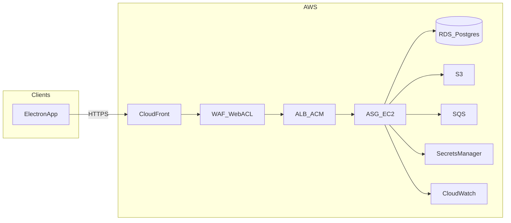

# Production cloud design (AWS)

**Purpose:** Describe the **production / beta** AWS deployment: request path, components, deployment-related **business rules**, and **HLD/LLD** for cloud infrastructure. Authoritative product behavior remains in the BRD, HLD, and LLD linked below; this document adds **cloud-specific** constraints and settings.

**Audience:** Developers and operators implementing or maintaining Terraform, runtime config, and releases.

**Related beta plan:** Cursor plan `beta_aws_production_plan_ad76cfe7` (IaC todos and phased rollout).

---

## 1. System context

### 1.1 Logical request flow

```text
User → CloudFront → WAF → ALB → EC2 → Nginx → Gunicorn → Uvicorn → FastAPI
```

- **User** clients include the **Electron** desktop app (and any browser-based access configured with the same API base URL).
- **EC2** instances are managed by an **Auto Scaling Group** (see §3.4).

### 1.2 Diagram (conceptual)



**Implementation note:** In AWS, **WAFv2** is **associated** with **CloudFront** or a **regional** resource (e.g. ALB). It is not a separate routed hop. The usual pattern with CloudFront in front is **one** Web ACL on the **CloudFront** distribution (inspection at edge before origin fetch). **CloudFront-scoped** Web ACLs are defined in **us-east-1** per AWS requirements; regional resources (ALB, RDS, ASG) may live in e.g. **ap-south-1**—Terraform typically uses a second `provider "aws"` alias for `us-east-1` where needed.

---

## 2. Component inventory

### 2.1 CloudFront

- **Role:** HTTPS entry for users; **origin** = **ALB** (application load balancer).
- **TLS:** Viewer certificate via **ACM** in **us-east-1** (CloudFront requirement).
- **Caching:** Configure **behaviors** so **API** paths are not cached incorrectly (e.g. forward all headers/cookies for authenticated API, or disable cache for `/` API routes). Exact behavior list is implementation-specific.

### 2.2 AWS WAF

- **Role:** Rate limits and managed rule groups at the edge (or regional on ALB if chosen—prefer **one** primary association to avoid duplicate tuning).
- **Tuning:** Long-running requests and large uploads must be allowed after testing; align with **Gunicorn timeout** and **Nginx** timeouts (§4.2).

### 2.3 Application Load Balancer (ALB) + ACM

- **Role:** Load balance to **EC2** instances in the **target group**; **TLS** between **CloudFront** and **ALB** (ACM certificate in the **same region** as ALB, e.g. ap-south-1).
- **Health checks:** Should target a stable HTTP path such as **`/health`** (see `backend/app/routers/health.py`).

### 2.4 Auto Scaling Group (ASG) + EC2

| Setting | Value |
|---------|--------|
| Min | 1 |
| Desired | 1 |
| Max | 2 |

- **Launch Template:** OS, instance type, IAM instance profile, **user-data** (bootstrap), security groups.
- **Application stack on instance:** **Nginx** → **Gunicorn** → **FastAPI**; **systemd** processes for **watcher** and other automation (see §5).

### 2.5 Gunicorn and Nginx (locked per instance)

| Setting | Value |
|---------|--------|
| `workers` | 4 |
| `worker_class` | `uvicorn.workers.UvicornWorker` |
| `timeout` | 60 (seconds) |

- **Nginx:** `proxy_read_timeout` (and related proxy timeouts) should be **≥ 60** seconds so the proxy does not close before Gunicorn.

### 2.6 RDS (PostgreSQL)

- Small instance class to start; **automated backups**, **encryption at rest**, **private subnets**, access only from application security group.

### 2.7 S3

- **Artifacts** (uploads, OCR output, challans, bulk uploads): **object keys** with **per-dealer** prefixes; **block public access**; encryption at rest.

### 2.8 SQS

- Standard queue for async/bulk work; **DLQ** where appropriate; IAM scoped to queue ARNs. **Consumer semantics** must be safe when **two** EC2 instances run (§5).

### 2.9 Secrets Manager

- Store **`DATABASE_URL`**, **`JWT_SECRET`**, and other secrets; inject at runtime (avoid plain secrets in Terraform state where possible).

### 2.10 CloudWatch

- Logs and metrics from EC2 (agent), **ALB**, **RDS**, **WAF**, optional **CloudFront**; **alarms** on error rates and resource saturation.

### 2.11 Terraform

- **IaC** for VPC, edge (CloudFront, WAF, ALB, ACM), ASG, RDS, S3, SQS, IAM, etc.
- **Remote state:** S3 + DynamoDB table for locking (or Terraform Cloud).

---

## 3. HLD (production cloud)

| Layer | Components |
|-------|----------------|
| **Edge** | CloudFront, WAF, public DNS |
| **Ingress** | ALB, ACM |
| **Compute** | ASG, EC2, Nginx, Gunicorn, FastAPI, systemd workers |
| **Data** | RDS PostgreSQL, S3 |
| **Async** | SQS (+ DLQ) |
| **Secrets** | Secrets Manager, IAM instance profiles |
| **Observability** | CloudWatch |

**Trust boundaries:** Internet clients **only** reach **CloudFront**; **ALB** is not directly exposed to end users if all traffic goes through CloudFront (security group rules should enforce **CloudFront → ALB** patterns as appropriate for your account setup).

---

## 4. LLD (implementation notes)

### 4.1 Health checks

- **ALB → target:** `GET /health` (or configured path) on the app port behind Nginx.
- **Gunicorn:** Four worker processes per instance handling concurrent ASGI requests.

### 4.2 Timeouts

- **Gunicorn `timeout`:** 60 seconds.
- **Nginx:** Upstream read timeout **≥ 60s** for API locations.

### 4.3 WAF + CloudFront

- Prefer **single** Web ACL on **CloudFront** for the logical flow “CloudFront → WAF → ALB”.
- Terraform: account for **us-east-1** provider for CloudFront + CloudFront-scoped WAF resources.

### 4.4 Terraform layout (pointer)

- Repository `terraform/` (to be added during implementation): modules for **network**, **data**, **edge**, **compute**, **observability**; stacks per environment (`staging`, `prod`).

---

## 5. Business rules (deployment-relevant)

These **restate** constraints that affect how we deploy and scale; numbered business rules live in the BRD/HLD.

1. **Authentication:** Production must not run with **`AUTH_DISABLED=true`**. JWT secret must meet application minimum length (see `backend/app/main.py` lifespan validation).
2. **Multi-tenancy:** API and storage must scope data by **authenticated dealer** (JWT), not a single environment `DEALER_ID` for all tenants.
3. **CORS:** `CORS_ORIGINS` must list **explicit** production origins (e.g. Electron or web origins); do not rely on development-only regex defaults.
4. **Encryption:** RDS and S3 use **encryption at rest**; TLS in transit from clients to CloudFront and from CloudFront to ALB.
5. **ASG max = 2 + background workers:** When **two** instances run, **each** could start **watcher/automation** via systemd—risk of **duplicate** SQS processing or **duplicate** Playwright jobs. **Decision required before scale-out:** e.g. (a) **leader election** / **single active consumer**, (b) **FIFO** + deduplication, (c) **idempotent** job handlers, or (d) **separate** single-instance worker tier. Until decided, **desired capacity = 1** avoids the split-brain class of issues at the cost of no horizontal scaling.

---

## 6. Related documents

| Document | Role |
|----------|------|
| [business-requirements-document.md](business-requirements-document.md) | Business requirements |
| [high-level-design.md](high-level-design.md) | System HLD |
| [low-level-design.md](low-level-design.md) | LLD detail |
| [technical-architecture.md](technical-architecture.md) | Technical architecture |
| [Database DDL.md](Database%20DDL.md) | Schema |
| [aws-setup-step-by-step.md](aws-setup-step-by-step.md) | Historical/local AWS setup; **production** uses Terraform per plan |

---

## 7. Versioning

| Version | Date | Notes |
|---------|------|--------|
| 0.1 | 2026-04-15 | Initial production cloud design: CloudFront, WAF, ALB, ASG 1/1/2, Gunicorn settings, BR/deployment rules |
