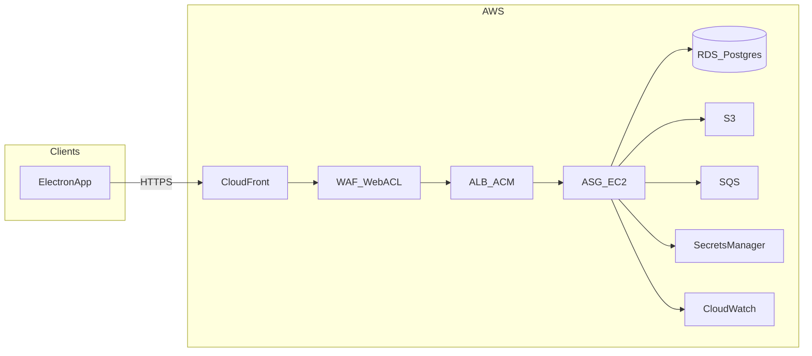

# Production cloud design (AWS)

**Purpose:** Describe the **production / beta** AWS deployment: request path, components, deployment-related **business rules**, and **HLD/LLD** for cloud infrastructure. Authoritative product behavior remains in the BRD, HLD, and LLD linked below; this document adds **cloud-specific** constraints and settings.

**Audience:** Developers and operators implementing or maintaining Terraform, runtime config, and releases.

**Related beta plan:** Cursor plan `beta_aws_production_plan_ad76cfe7` (IaC todos and phased rollout).

---

## 1. System context

### 1.1 Logical request flow

```text
User → CloudFront → WAF → ALB → EC2 → Nginx → Gunicorn → Uvicorn → FastAPI
```

- **User** clients include the **Electron** desktop app (and any browser-based access configured with the same API base URL).
- **EC2** instances are managed by an **Auto Scaling Group** (see §3.4).

### 1.2 Diagram (conceptual)



**Implementation note:** In AWS, **WAFv2** is **associated** with **CloudFront** or a **regional** resource (e.g. ALB). It is not a separate routed hop. The usual pattern with CloudFront in front is **one** Web ACL on the **CloudFront** distribution (inspection at edge before origin fetch). **CloudFront-scoped** Web ACLs are defined in **us-east-1** per AWS requirements; regional resources (ALB, RDS, ASG) may live in e.g. **ap-south-1**—Terraform typically uses a second `provider "aws"` alias for `us-east-1` where needed.

---

## 2. Component inventory

### 2.1 CloudFront

- **Role:** HTTPS entry for users; **origin** = **ALB** (application load balancer).
- **TLS:** Viewer certificate via **ACM** in **us-east-1** (CloudFront requirement).
- **Caching:** Configure **behaviors** so **API** paths are not cached incorrectly (e.g. forward all headers/cookies for authenticated API, or disable cache for `/` API routes). Exact behavior list is implementation-specific.

### 2.2 AWS WAF

- **Role:** Managed rule groups, IP deny-list, and rate limiting at the edge (**CloudFront** scope, us-east-1). Single primary association on CloudFront to avoid duplicate tuning.
- **Scanner IP-set block:** `aws_wafv2_ip_set.scanner_block` (Terraform var **`waf_scanner_block_cidrs`**, default **`["103.75.173.0/24"]`**) is referenced by the highest-priority rule **`BlockScannerIpSet`** (priority 1, **block**). Added after an unauthorized daily **Qualys** vulnerability scan (UA `QualysGuard`, marker path `/QUALYS730242`) was found hitting the ALB directly. Blocking at the WAF stops it even if it reaches the CloudFront hostname.
- **Rate-based rule:** **`RateLimitCount`** (priority 2), aggregate by **IP** over a **5-minute** window, limit from **`waf_rate_limit_per_5min`** (default **2000**). Deployed in **`count` mode** (observe only) with `/health` excluded via a scope-down `not_statement`; tune the limit from ALB access logs (§2.3) before switching the action to `block`. A single office behind one NAT IP and chatty upload/SSE sessions are the main false-positive risks, hence count-first.
- **Managed rule groups (unchanged):** CommonRuleSet (+ uploads-exclusions variant), KnownBadInputs, AnonymousIpList, AmazonIpReputationList, Linux/Unix rule sets.
- **Tuning:** Long-running requests and large uploads must be allowed after testing; align with **Gunicorn timeout** and **Nginx** timeouts (§4.2).

### 2.3 Application Load Balancer (ALB) + ACM

- **Role:** Load balance to **EC2** instances in the **target group**; listener is **HTTP:80** only (TLS terminates at CloudFront; origin protocol is `http-only`).
- **Ingress lock (CloudFront-only):** the ALB security group (`saathi-sg-alb`) ingress on port 80 is restricted to the **CloudFront origin-facing managed prefix list** (`com.amazonaws.global.cloudfront.origin-facing`) whenever CloudFront is enabled, instead of `0.0.0.0/0`. This makes the raw ALB DNS name unreachable from arbitrary internet clients, so all traffic must flow through CloudFront + WAF. `var.alb_ingress_cidr_blocks` is only used as a fallback when CloudFront is disabled. The unused port-443 ingress rule was removed (no HTTPS listener on the ALB).
- **Access logs:** enabled to S3 (`access_logs` on `aws_lb.public`, prefix `saathi-alb`) → bucket in §2.7. Gives per-request client IP / path / user-agent (queryable via Athena) to attribute future traffic spikes; previously no ALB log sink existed.
- **Health checks:** Should target a stable HTTP path such as **`/health`** (see `backend/app/routers/health.py`).

### 2.4 Auto Scaling Group (ASG) + EC2

| Setting | Value |
|---------|--------|
| Min | 1 |
| Desired | 1 |
| Max | 2 |

- **Launch Template:** OS, instance type, IAM instance profile, **user-data** (bootstrap), security groups; **root EBS gp3** size from **`ec2_root_volume_size_gb`** (default **40 GiB**; avoids **`dnf` / CloudWatch agent** failing on the AMI’s small default root volume).
- **Health check:** **ELB**-based; **grace period** 300s; **default cooldown** 300s; **scale-in protection** off unless changed.
- **Step scaling (no target tracking):** scale-out **+1** (step policy, `estimated_instance_warmup` 300s) on load signals. **Per AWS and Terraform, `cooldown` is not valid on `StepScaling` policies**; spacing between *any* scaling activities on the group is governed by the ASG’s **`default_cooldown` (300s)**.
- **Scale-in:** **Simple** scaling **−1**; policy **`cooldown` = 600s** by default (variable `asg_scale_in_cooldown_seconds`), so scale-in is slower than the group’s 300s default between activities. Triggers: sustained low CPU (see §7.4). **Max size capped at 2** in Terraform validation.
- **Application stack on instance:** **Nginx** → **Gunicorn** → **FastAPI**; **systemd** processes for **watcher** and other automation (see §5).

### 2.5 Gunicorn and Nginx (locked per instance)

Source: `deploy/ec2/gunicorn.conf.py` (loaded by `deploy/ec2/saathi-api.service` / `run-gunicorn.sh`).

| Setting | Value |
|---------|--------|
| `workers` | 3 (Uvicorn workers; suited to **~2 vCPU** class instances) |
| `worker_class` | `uvicorn.workers.UvicornWorker` |
| `keepalive` | 5 (seconds) |
| `timeout` | 60 (seconds) |
| `graceful_timeout` | 30 (seconds) |
| `max_requests` | 1000 |
| `max_requests_jitter` | 100 |
| `threads` | 1 (async workers; no Gunicorn thread pool) |

- **Nginx:** `proxy_read_timeout` (and related proxy timeouts) should be **≥ 60** seconds so the proxy does not close before Gunicorn.

### 2.6 RDS (PostgreSQL)

- **Instance class:** **`db.t4g.micro`** (as deployed; Terraform default aligned to this).
- **Storage:** **gp3**, **20 GiB** initial, **storage autoscaling** up to **100 GiB** (`max_allocated_storage`); encryption at rest.
- **Backups:** retention **15 days**; **deletion protection** enabled (Terraform).
- **Credentials:** master password in **Secrets Manager** (`manage_master_user_password`); app **`DATABASE_URL`** built via **`deploy/ec2/write-database-url.sh`** where used.
- **Private subnets**; access only from application security group.
- **Alarm context:** **`rds_max_connections_for_alarms`** = **45** for connection-threshold alarms; **free-disk** alarm when **`FreeStorageSpace`** &lt; **5 GiB** (see §7.3–7.4).

### 2.7 S3

- **Artifacts** (uploads, OCR output, challans, bulk uploads): **object keys** with **per-dealer** prefixes; **block public access**; encryption at rest.
- **Terraform:** `terraform/network/s3_data.tf` defines the data bucket (name `"{project_name}-data-{account_id}"`). EC2 IAM allows `GetObject` / `PutObject` / `ListBucket` on that bucket only. Set **`S3_DATA_BUCKET`** on the app host and **`STORAGE_BACKEND=s3`** so the API syncs `Uploaded scans/` and `ocr_output/` trees under keys `uploaded-scans/{dealer_id}/…` and `ocr-output/{dealer_id}/…`. **Presigned GET URLs** are returned in **`print_jobs`** on Fill DMS / Insurance / Gate Pass responses for the Electron client to print locally (the server does not print to dealer printers).
- **ALB access-logs bucket:** `terraform/network/s3_alb_logs.tf` defines `"{project_name}-alb-logs-{account_id}"` (private, SSE-S3, **90-day** lifecycle expiry). Bucket policy grants the ap-south-1 **ELB log-delivery account** (`718504428378`, via `data.aws_elb_service_account`) `s3:PutObject` under `{prefix}/AWSLogs/{account_id}/*`. Referenced by the ALB `access_logs` block (§2.3).

### 2.8 SQS

- Standard queue for async/bulk work; **DLQ** where appropriate; IAM scoped to queue ARNs. **Consumer semantics** must be safe when **two** EC2 instances run (§5).

### 2.9 Secrets Manager

- Store **`DATABASE_URL`**, **`JWT_SECRET`**, and other secrets; inject at runtime (avoid plain secrets in Terraform state where possible).

### 2.10 CloudWatch

- **CloudWatch Agent on EC2** (user_data): **`mem_used_percent`**, **`disk_used_percent`** → namespace **`CWAgent`**. **No** custom CW Agent CPU for alarms—EC2 **native** `AWS/EC2` **`CPUUtilization`** is used (see §7.4–7.5).
- **Alarms** (where enabled): **EC2** (CPU, memory), **ALB** (latency, 5xx, request rate per target, healthy hosts), **RDS** (CPU, free memory, connections, **free disk**), **SQS** (optional, when `sqs_alarm_queue_names` is set in Terraform). **SNS** for notifications; **ASG** policies linked from scale-out/scale-in alarms as in §7.4.
- **Resilience defaults (Terraform):** **`treat_missing_data = notBreaching`**, **`evaluation_periods = 2`**, **`datapoints_to_alarm = 2`** on most metric alarms. **Exception:** ALB **`RequestCountPerTarget`** scale-out alarms use **4 of 5** (see §7.4).

### 2.11 Terraform

- **IaC** for VPC, edge (CloudFront, WAF, ALB, ACM), ASG, RDS, S3, SQS, IAM, etc.
- **Remote state:** S3 + DynamoDB table for locking (or Terraform Cloud).

---

## 3. HLD (production cloud)

| Layer | Components |
|-------|----------------|
| **Edge** | CloudFront, WAF, public DNS |
| **Ingress** | ALB, ACM |
| **Compute** | ASG, EC2, Nginx, Gunicorn, FastAPI, systemd workers |
| **Data** | RDS PostgreSQL, S3 |
| **Async** | SQS (+ DLQ) |
| **Secrets** | Secrets Manager, IAM instance profiles |
| **Observability** | CloudWatch |

**Trust boundaries:** Internet clients **only** reach **CloudFront**. The **ALB is not directly exposed**: its security group ingress (port 80) is locked to the **CloudFront origin-facing prefix list** (§2.3), so the raw ALB DNS name cannot be scanned or reached directly, and all traffic is inspected by the CloudFront-scoped WAF (§2.2) before origin fetch.

---

## 4. LLD (implementation notes)

### 4.1 Health checks

- **ALB → target:** `GET /health` (or configured path) on the app port behind Nginx.
- **Gunicorn:** **Three** Uvicorn workers per instance (see §2.5) handling concurrent ASGI requests.

### 4.2 Timeouts

- **Gunicorn `timeout`:** 60 seconds.
- **Nginx:** Upstream read timeout **≥ 60s** for API locations.

### 4.3 WAF + CloudFront

- Prefer **single** Web ACL on **CloudFront** for the logical flow “CloudFront → WAF → ALB”.
- Terraform: account for **us-east-1** provider for CloudFront + CloudFront-scoped WAF resources (`aws.us_east_1` alias); `aws_wafv2_ip_set.scanner_block` uses the same provider/scope.
- **Rule order (low priority = first):** `BlockScannerIpSet` (1, block) → `RateLimitCount` (2, count) → managed groups (10–60). Keep custom deny/rate rules above managed groups.
- **Rate rule lifecycle:** ships as `count {}`; review the `saathi-RateLimitCount` CloudWatch metric / WAF sampled requests against real traffic (using ALB access logs to find the busiest legitimate single-IP rate) before changing the action to `block {}` and finalizing `waf_rate_limit_per_5min`.
- **ALB reachability:** the ALB SG is locked to the CloudFront origin prefix list; do not re-open ALB ingress to `0.0.0.0/0` (it would bypass the WAF).

### 4.4 Terraform layout (pointer)

- Repository `terraform/` (to be added during implementation): modules for **network**, **data**, **edge**, **compute**, **observability**; stacks per environment (`staging`, `prod`).

---

## 5. Business rules (deployment-relevant)

These **restate** constraints that affect how we deploy and scale; numbered business rules live in the BRD/HLD.

1. **Authentication:** Production must not run with **`AUTH_DISABLED=true`**. JWT secret must meet application minimum length (see `backend/app/main.py` lifespan validation).
2. **Multi-tenancy:** API and storage must scope data by **authenticated dealer** (JWT), not a single environment `DEALER_ID` for all tenants.
3. **CORS:** `CORS_ORIGINS` must list **explicit** production origins (e.g. Electron or web origins); do not rely on development-only regex defaults.
4. **Encryption:** RDS and S3 use **encryption at rest**; TLS in transit from clients to CloudFront and from CloudFront to ALB.
5. **ASG max = 2 + background workers:** When **two** instances run, **each** could start **watcher/automation** via systemd—risk of **duplicate** SQS processing or **duplicate** Playwright jobs. **Decision required before scale-out:** e.g. (a) **leader election** / **single active consumer**, (b) **FIFO** + deduplication, (c) **idempotent** job handlers, or (d) **separate** single-instance worker tier. Until decided, **desired capacity = 1** avoids the split-brain class of issues at the cost of no horizontal scaling.

---

## 6. Related documents

| Document | Role |
|----------|------|
| [business-requirements-document.md](business-requirements-document.md) | Business requirements |
| [high-level-design.md](high-level-design.md) | System HLD |
| [low-level-design.md](low-level-design.md) | LLD detail |
| [technical-architecture.md](technical-architecture.md) | Technical architecture |
| [Database DDL.md](Database%20DDL.md) | Schema |
| [aws-setup-step-by-step.md](aws-setup-step-by-step.md) | Historical/local AWS setup; **production** uses Terraform per plan |
| [rds-backup-recovery.md](rds-backup-recovery.md) | RDS backups, PITR, snapshots |
| [`deploy/ec2/README.md`](../deploy/ec2/README.md) | EC2 app layout, Gunicorn, Nginx, systemd |
| [`deploy/ec2/DEPLOY.md`](../deploy/ec2/DEPLOY.md) | Deploy runbook (pull, pip, restart) |
| [`deploy/POST_ELECTRON_TODO.md`](../deploy/POST_ELECTRON_TODO.md) | Post–Electron backlog (deploy scripts, daily health check) |

---

## 7. As-built production decisions (April 2026)

This section records **what we configured in Terraform and runtime**, not every possible future option.

### 7.1 Region and IaC

- **Primary region:** **`ap-south-1`** for VPC, ALB, ASG, RDS, etc.
- **Terraform:** `terraform/network/` (single stack for this beta/prod pattern). **Remote state:** S3 + DynamoDB locking (see `terraform/network/versions.tf`).
- **Edge:** **CloudFront** + **WAF** (ACM viewer cert in **us-east-1**); API hostname example **`api.dealersaathi.co.in`** when enabled.

### 7.2 RDS (operational values)

| Decision | Choice |
|----------|--------|
| Instance class | **`db.t4g.micro`** |
| Engine | PostgreSQL (version pinned in Terraform, e.g. 16.x) |
| Allocated storage | **20 GiB** gp3 |
| Storage autoscaling ceiling | **100 GiB** |
| Backup retention | **15 days** |
| Deletion protection | **On** (Terraform) |
| Free-disk alarm | CloudWatch **`FreeStorageSpace`**: alarm when **free space &lt; 5 GiB** (metric is free bytes remaining; at a 100 GiB volume, ~5 GiB free corresponds to ~95 GiB used) |
| Connection alarms | **`rds_max_connections_for_alarms` = 45** for % thresholds |
| FreeableMemory alarms | Derived from instance class memory map in Terraform (**no** separate memory override variable) |

### 7.3 SNS and email

- **Topic name:** **`autoscaling-notifications`** (default; overridable via `sns_autoscaling_notifications_topic_name`).
- **Subscription:** **email** endpoint configured in Terraform (`alarm_notification_email`); **subscription must be confirmed** in the inbox before delivery.
- **Topic policy:** allows **CloudWatch** and **Auto Scaling** to **publish** (plus app use for alarm + ASG lifecycle notifications).
- **ASG lifecycle** (launch, terminate, launch/terminate errors) → same topic via **`aws_autoscaling_notification`**.

### 7.4 CloudWatch alarms and Auto Scaling policies

- **SNS:** Alarms use the topic for **alarm** and **OK** notifications (where configured for that resource). See §7.3.
- **Alarm evaluation:** **`treat_missing_data = notBreaching`** on these scaling-related alarms. **Most** alarms use **`evaluation_periods = 2`**, **`datapoints_to_alarm = 2`** (two consecutive in-range periods must breach or clear, depending on the alarm). **Exception:** ALB **`RequestCountPerTarget`** scale-out alarms use **`evaluation_periods = 5`**, **`datapoints_to_alarm = 4`** (four of the last five periods). See each alarm’s **`period`** for wall-clock length of one datapoint.
- **EC2 application metrics (in `terraform/network/cloudwatch_alarms_ec2.tf`):**
  - **API limitation:** Standard CloudWatch **metric alarms** do **not** support **`SEARCH()`** in `PutMetricAlarm`. The stack therefore does **not** use metric-math `SEARCH` on these alarms.
  - **CPU (`AWS/EC2`):** per **instance** `CPUUtilization` ( **`InstanceId`** in each metric). Terraform resolves current ASG instance IDs through **`data.aws_instances`** and builds metric math as **`m0`**, or **`MAX([m0,m1])`** / **`(m0+m1)/2`**, depending on in-service count (max 2 in this design). **Scale-out** alarms use a **5-minute** period (300s) on the underlying series; **scale-in** uses **10-minute** (600s) averages with **average CPU below 50%** (`(m0+m1)/2`), **2 of 2** evaluation. **After instance replacement, run `terraform apply` again** so alarms point at the new `InstanceId`s; otherwise the alarm can reference stale or missing series.
  - **Memory (`CWAgent`):** **`mem_used_percent`** with the same **`m0` / `MAX([m0,m1])`** pattern over per-instance **CWAgent** series. Dimensions must include **`InstanceId`** (and **AutoScalingGroupName** in agent `append_dimensions`; see §7.5).
- **Scale-out (+1, step policy):** Fired (via shared ASG step policy) from **any** of the EC2 CPU high alarms (warn/crit), or ALB **TargetResponseTime** (warn/crit), **RequestCountPerTarget** (warn/crit: **Sum** over **60s**, **> 200** warn / **> 400** crit per target, **4 of 5** periods), SQS **ApproximateNumberOfVisibleMessages** (warn/crit) when SQS is configured. **Not** target tracking. Step policy has no separate **`cooldown`**; ASG **`default_cooldown` 300s** still applies to follow-on activities.
- **Scale-in (−1, simple policy, default cooldown 600s on the policy):** Fired from the EC2 **low average CPU** alarm (**&lt; 50%** over **600s** buckets, **2 of 2**). Slower re-scale than scale-out by design.
- **Healthy hosts:** alarm when **`HealthyHostCount` &lt; 1** (with stack defaults above). A **degraded** alarm (exactly one healthy target) exists **only if** **`asg_min_size >= 2`**.
- **RDS:** CPU, FreeableMemory, DatabaseConnections, **free disk** — **SNS only** (no ASG hooks).
- **ALB HTTP 5xx:** SNS only (no ASG scaling from 5xx alone).

### 7.5 EC2 bootstrap and CloudWatch Agent

- **User data** installs **`amazon-ssm-agent` in a minimal `dnf` step first**, starts it, then installs **`amazon-cloudwatch-agent`**, **Nginx**, and the rest of bootstrap — so **Session Manager** can register even if a **later** package or script step fails (otherwise a failed first `dnf` transaction could leave the agent never installed/started).
- **Config file:** `/opt/aws/amazon-cloudwatch-agent/etc/amazon-cloudwatch-agent.json` — namespace **`CWAgent`**, **`append_dimensions`:** **`InstanceId`** (`${aws:InstanceId}`) and **`AutoScalingGroupName`** (`${aws:AutoScalingGroupName}`). **Metrics:** **`mem_used_percent`**, **`disk_used_percent`** (all mounted filesystems via `resources: ["*"]`). **No** custom CW Agent CPU for alerting—**CPU** alarms use **`AWS/EC2` `CPUUtilization`**, not the agent.
- **IAM:** **`CloudWatchAgentServerPolicy`** attached to the EC2 role (in addition to SSM, Secrets Manager, SSM parameters for JWT, etc.).
- **Rollout:** **Rebooting** an instance does **not** re-run user data. **Launch template / new instance** (e.g. ASG **instance refresh**) is required to pick up a changed JSON; then **re-run Terraform** for EC2 alarms if instance **IDs** changed, so the alarm’s per-instance metric queries match the current fleet.

### 7.6 Access model

- **Primary:** **SSM Session Manager** (no inbound SSH required; **`AmazonSSMManagedInstanceCore`** on the role).
- **SSH:** optional; would require SG rules + key on the launch template if introduced later.
- **Session Manager “Ping status: Offline”:** allow **~5–10 minutes** after launch for first registration. If it stays offline: confirm the instance has the **app IAM instance profile**, **NAT gateway** is available, and the **private route table** sends **`0.0.0.0/0`** to that NAT (SSM needs **HTTPS** to regional endpoints). If **`cloud-init`/user data failed**, read **`/var/log/user-data.log`** on the box once you have any shell access. Organizations that block **internet egress** to AWS APIs need **VPC interface endpoints** for **`com.amazonaws.<region>.ssm`**, **`ssmmessages`**, and **`ec2messages`** (not created by default in this stack).

### 7.7 Deferred / backlog (not blocking current prod)

- **SQS queue names** in Terraform (`sqs_alarm_queue_names`) when async queues are wired — enables SQS alarms + scale-out from backlog.
- **Deploy automation scripts** and **daily 08:00 synthetic health check** — tracked in **[`deploy/POST_ELECTRON_TODO.md`](../deploy/POST_ELECTRON_TODO.md)** (after Electron build stabilization).
- **Routine smoke tests** (health, login) — operational validation, not infra.

### 7.8 Edge hardening — ALB lock, access logs, scanner block (July 2026)

Triggered by the daily off-hours **`saathi-alb-request-rate-warn`** alarm. Investigation (CloudWatch `RequestCount`/HTTP-code metrics + on-instance `nginx` access log via SSM) showed an unauthorized **Qualys** vulnerability scan from **`103.75.173.20`** (UA `QualysGuard`, marker `/QUALYS730242`) hitting the **raw ALB DNS directly**, bypassing CloudFront/WAF. ~10,042 of ~10,330 requests returned **401** from `AuthMiddleware` (no breach), but the burst still triggered wasteful **ASG scale-out** (the alarm is wired to the scale-out step policy, §7.4).

As-built changes (all in `terraform/network/`):

- **ALB ingress locked to CloudFront** (`security_groups.tf`, §2.3) — port 80 uses the `com.amazonaws.global.cloudfront.origin-facing` prefix list; raw ALB DNS no longer reachable directly. In-place SG update (description kept to avoid replacement).
- **WAF scanner IP-set block + rate rule (count mode)** (`cloudfront_waf.tf`, §2.2) — `BlockScannerIpSet` blocks `103.75.173.0/24`; `RateLimitCount` observes 2000/5min per IP. New vars `waf_scanner_block_cidrs`, `waf_rate_limit_per_5min` in `variables.tf`.
- **ALB access logs to S3** (`s3_alb_logs.tf` + `alb.tf`, §2.3/§2.7) — closes the prior per-request source-IP visibility gap.

Follow-ups: after access logs accumulate, tune and flip `RateLimitCount` to `block`; consider decoupling scanner-driven bursts from ASG scale-out (alarm tuning per §7.4). If a Qualys/other scan is ever **authorized**, allowlist rather than block.

---

## 8. Versioning

| Version | Date | Notes |
|---------|------|--------|
| 0.1 | 2026-04-15 | Initial production cloud design: CloudFront, WAF, ALB, ASG 1/1/2, Gunicorn settings, BR/deployment rules |
| 0.2 | 2026-04-18 | §7 as-built: RDS t4g.micro + storage/autoscale/backups, SNS `autoscaling-notifications`, CW alarms + step scaling, CW Agent mem/disk, healthy-host logic, access model, pointers to deploy/RDS docs |
| 0.3 | 2026-04-24 | Gunicorn **3** workers, keepalive/rotation settings (§2.5); **no** `SEARCH` in EC2 alarms, per-`InstanceId` CPU + CWAgent mem with **`data.aws_instances`**; alarm **2×2** resilience and **`notBreaching` everywhere**; **StepScaling** has no `cooldown`, ASG 300s + **scale-in** policy 600s; **CW Agent** `InstanceId` + `AutoScalingGroupName`; runbook: **apply after ASG instance churn**; §7.4–7.5 updated |
| 0.4 | 2026-05-13 | §7.4: EC2 CPU **scale-in** **&lt; 50%** avg on **600s** (**2 of 2**); ALB **RequestCountPerTarget** scale-out **Sum/60s**, **200/400** warn/crit, **4 of 5** evaluation; alarm-evaluation bullet generalized; metric math **`MAX([m0,m1])`** for multi-instance max CPU/mem (PutMetricAlarm rejects **`MAX(m0,m1)`**) |
| 0.4.1 | 2026-05-13 | §7.5 / launch `user_data`: explicit **`amazon-ssm-agent`** install + early **`systemctl`** so Session Manager is not stuck **Offline** during long bootstrap |
| 0.4.3 | 2026-05-13 | App **launch template**: explicit **root gp3** volume (**`ec2_root_volume_size_gb`**, default **40 GiB**, encrypted) — fixes **`dnf` “needs … more space on /”** during user_data (CloudWatch agent + dev packages); §2.4 updated |
| 0.4.2 | 2026-05-13 | Launch `user_data`: **`amazon-ssm-agent`** installed in a **dedicated early `dnf`** before the main package set (avoid SSM never starting if the large `dnf` fails); §7.5–7.6 updated |
| 0.5 | 2026-07-19 | **Edge hardening** (§7.8): ALB ingress locked to **CloudFront origin-facing prefix list** (§2.3), **WAF scanner IP-set block** `103.75.173.0/24` + **rate rule in count mode** (§2.2, §4.3), **ALB access logs to S3** (§2.3, §2.7); trust boundaries tightened (§3). Response to unauthorized daily Qualys scan hitting the ALB directly |
